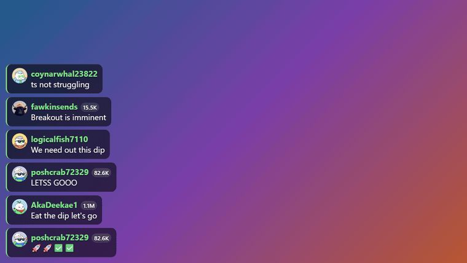
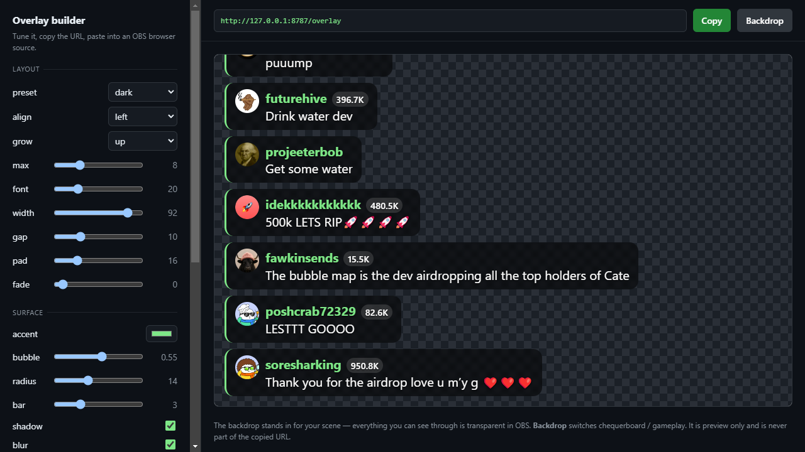

# pumpstream

Live pump.fun comments as an event stream, gated to wallets that **actually hold the token**.

Point it at a mint, get a clean feed of comments where every author has been balance-checked on-chain. Drop it straight into OBS as a browser source, consume it as a Node library, or subscribe from any language or engine over the local server.



*Real pump.fun chat, live. Every name carries the wallet's on-chain balance; non-holders never make it to the screen.*

```bash
npx pumpstream <mint> --holders-only
```

```
pumpstream listening on http://127.0.0.1:8787
  mint         DDVUsN8sDFxbaX6gNBoD44kjZhFETWJnwAn4EX1dpump
  holders-only true
  websocket    ws://127.0.0.1:8787

✓ vukasle [412,900]: exited at 30k back at it in 100k
```

## Why holder-gating

Open token chat is mostly bots, shills, and scams. The first message this project ever pulled from a live room was a suicide-framed giveaway scam from a wallet holding **zero** of the token. A holder gate deletes that entire class of noise for free, and turns "who gets to appear on my stream" into something backed by on-chain stake rather than moderation effort.

It is a spam filter, **not a safety layer** — see [Moderation](#moderation).

## Install

```bash
npm install pumpstream
```

Node 18+. One dependency (`ws`).

## Library

```js
import { PumpComments } from 'pumpstream';

const feed = new PumpComments({
  mint: '<token mint>',
  holdersOnly: true,
  minBalance: 1000,   // require a real bag, not dust
  history: 20,        // replay recent comments on connect
});

feed.on('comment', (c) => {
  console.log(c.username, c.text, c.balance);
});

feed.on('drift', (d) => console.error('upstream changed:', d.kind, d.detail));

await feed.start();
```

### Comment shape

```js
{
  id: '7745eda5-…',
  mint: 'DDVUsN8s…pump',
  text: 'gm holders',
  author: '6GtKSyfB…ywTC',      // wallet address
  username: 'kindlycrab78735',
  avatar: 'https://ipfs.io/ipfs/…',
  timestamp: '2026-08-08T18:23:01.144Z',
  expiresAt: '2026-09-08T…',     // pump.fun expires chat history — persist what you need
  isCreator: false,
  isModerator: false,
  type: 'REGULAR',
  replyTo: { id: '4dd4…', preview: 'Because it brings…' },  // null if not a reply
  reactions: { ':fire:': { recent: ['4ua8…'], avatars: ['https://…'] } },  // null if none
  holder: true,                  // filled in by the gate
  balance: 412900,               // UI amount, summed across token accounts
  holderUnknown: false,          // true = the lookup FAILED, not "holds nothing"
  historical: false,             // true if from the replay buffer
  raw: { … }                     // untouched upstream object
}
```

### Options

| Option | Default | |
|---|---|---|
| `mint` / `mints` | — | token(s) to follow |
| `holdersOnly` | `false` | drop non-holders instead of just labelling them |
| `minBalance` | `0` | UI-amount required to count as a holder |
| `rpcUrl` | public mainnet | **use a paid RPC for real traffic** |
| `holderTtlMs` | `60000` | how long a balance stays fresh |
| `history` | `0` | replay the last N comments on connect |

### Events

`comment` · `filtered` (failed the gate) · `presence` · `viewers` · `drift` · `degraded` · `reconnect` · `error` · `open` · `close`

`drift` fires when pump.fun's message shape changes. `degraded` fires when the holder gate itself is broken — see [Rate limits](#rate-limits). Handle both: they are how you find out the feed is lying to you.

## Local server

One upstream connection, many local subscribers.

```bash
npx pumpstream <mint> --holders-only --min-balance 1000 --port 8787
npx pumpstream --discover      # list live tokens and their mints
```

| | |
|---|---|
| `ws://localhost:8787` | every event as JSON `{type, data}` |
| `GET /overlay` | the OBS browser source |
| `GET /overlay/config` | live builder for the overlay |
| `GET /health` | liveness + upstream connection state |
| `GET /comments?limit=50` | recent buffer, for polling clients |
| `GET /stats` | counters + holder-cache efficiency |

Filter a socket to one mint with `ws://localhost:8787?mint=<mint>`. CORS is open, so a browser page or game client can read it directly. See `examples/consume.html`.

Because it fans out locally, **run one server per mint, not one connection per viewer** — see [Rate limits](#rate-limits).

## OBS overlay

Start the server, then add a **Browser Source** in OBS pointing at:

```
http://localhost:8787/overlay
```

Set the width and height to the area you want chat to occupy. The background is transparent, so it composites straight over your scene — no chroma key, no window capture.


*Actual OBS program output. The blue is a stand-in for gameplay — the overlay paints nothing behind itself.*

### Build your look without hand-writing URLs

```
http://localhost:8787/overlay/config
```

Every option as a control, a live preview on a chequerboard so you can see exactly what is transparent, and the finished URL ready to copy into OBS.



### Presets

One parameter for a whole look. Anything you set explicitly still wins over the preset.

| `?preset=` | |
|---|---|
| `dark` | default — translucent dark bubbles |
| `light` | light bubbles, dark text |
| `minimal` | no bubble, no bar, no avatars — text only |
| `solid` | opaque bubbles, no blur |
| `ghost` | text on the scene, nothing else |


*`?preset=minimal&font=26&accent=ffd479` — no bubbles at all, held legible by the text shadow.*

### Every option

**Layout**

| | default | |
|---|---|---|
| `max` | `8` | comments kept on screen |
| `fade` | `0` | seconds before a comment leaves (`0` = never) |
| `font` | `20` | base font size in px |
| `align` | `left` | `left`, `center`, `right` |
| `grow` | `up` | `up` (newest at the bottom) or `down` |
| `width` | `92` | max pill width, % of the source |
| `gap` | `10` | space between comments, px |
| `pad` | `16` | padding around the feed, px |

**Surface**

| | default | |
|---|---|---|
| `theme` | `dark` | `dark` or `light` |
| `accent` | `#7ee787` | names and the side bar; hex, with or without `#` |
| `text` | theme | text colour override |
| `bubble` | `0.55` | bubble opacity, `0`–`1` (`0` = no bubble) |
| `radius` | `14` | corner radius, px |
| `bar` | `3` | accent bar width, px (`0` = none) |
| `shadow` | `1` | text shadow |
| `blur` | `1` | backdrop blur behind bubbles |
| `anim` | `1` | enter/leave animation |

**Content**

| | default | |
|---|---|---|
| `avatars` | `1` | profile pictures |
| `names` | `1` | usernames |
| `balance` | `1` | holder balance badge |
| `badges` | `1` | `dev` / `mod` tags |
| `replies` | `1` | quoted parent of a reply |
| `time` | `0` | `HH:MM` timestamp |
| `status` | `1` | corner badge when the feed breaks |

**Filtering and plumbing**

| | default | |
|---|---|---|
| `holders` | `0` | drop non-holders in this source |
| `minbal` | `0` | minimum balance to appear |
| `censor` | `off` | `mask` stars out profanity, `drop` hides the comment |
| `block` | — | extra terms to censor, comma separated |
| `replay` | `10` | recent comments shown immediately on connect |
| `mint` | — | pin to one token if the server follows several |
| `demo` | — | `grid` or `scene` backdrop, for previewing outside OBS |

Booleans accept `1/0`, `true/false`, `yes/no`, `on/off`. Out-of-range numbers are clamped, unknown values fall back to the default, and a non-hex colour is rejected rather than written into the stylesheet.

Because `holders` and `minbal` are applied in the overlay, one server can feed several sources with different rules — an unfiltered mod view and a whales-only on-stream view, from the same connection.

```
http://localhost:8787/overlay?preset=minimal&font=26&align=right&holders=1&minbal=50000&fade=30
```

### Transparency

The page never paints a background — not in any theme, not in any preset. That is enforced in the stylesheet, asserted across every preset in the test suite, and checked against real OBS output:

```bash
npm run test:transparency -- <obs-websocket-password>
```

It decodes the alpha channel of what OBS actually renders:

```
size          : 1280x720
fully clear   : 772928 px (83.9%)
semi          : 134954 px (14.6%)
fully opaque  : 13718 px (1.5%)
top 15% strip : 0 non-transparent px

PASS — the overlay composites over the scene rather than covering it.
```

Verified the same way for `solid`, `light`, `minimal` and `ghost` — including the opaque-bubble preset, which is the one most likely to fill the frame by accident.

Two more things worth knowing:

- **It tells you when it is broken.** If the upstream shape changes or holder checks start failing, a small red badge appears in the corner — because an overlay that silently shows nothing is indistinguishable from a quiet chat. Pass `status=0` to suppress it.
- **It reconnects on its own, and comes back populated.** OBS suspends and reloads browser sources constantly. The overlay retries with backoff, and the server replays the last few comments on every connect — otherwise a reload leaves you staring at an empty box that reads as "chat is dead".

Comment text is rendered with `textContent`, never `innerHTML` — chat is untrusted input and this is on your stream.

---

## Read this before you depend on it

### pump.fun has no public API

Everything here is reverse-engineered from live traffic and can break without a changelog. That is not a hypothetical:

- `GET https://frontend-api-v3.pump.fun/replies/{mint}` — the comments endpoint in every community spec — now returns `404 Cannot GET /replies/…`
- `frontend-api-v2.pump.fun` returns `503`; `frontend-api.pump.fun` returns Cloudflare `1016`

Comments moved to a Socket.IO service at `wss://livechat.pump.fun`, which is what this library speaks.

**Every pump.fun-specific detail lives in [`src/adapter.js`](src/adapter.js).** URLs, handshake, event names, and field mapping are all in that one file, so a breaking change is a small edit rather than a rewrite.

### It tells you when it breaks

Silent failure is the real danger — a stream overlay that quietly stops is worse than one that errors. So:

- Messages are classified **by shape, not by event name**, so an upstream rename doesn't stop the feed
- Losing a field the gate depends on emits a loud `drift` event (and prints to stderr if nothing is listening)
- New upstream fields also raise `drift`, so you find out that something changed before it bites

`drift` earned its place during development: it caught two real unmapped fields on live traffic (`expiresAt`, threaded replies via `replyToId`/`replyPreview`, and emoji reactions via `reactionRecent*`) — all now mapped. Each was found by the detector rather than by noticing something looked wrong.

### Rate limits

Opening many sockets quickly gets you throttled — measured, not guessed: 10 sequential connections produced **20 socket errors and 0 comments**, while a single connection worked immediately. One upstream connection fanned out locally is the supported pattern.

Holder checks are batched into single JSON-RPC calls and cached per wallet — in testing, 300 lookups across 3 wallets collapsed into **1 RPC call**.

**Use a paid RPC.** The public Solana endpoint rate-limits this method hard, and it is not subtle:

```
{"error":{"code":429,"message":"Too many requests for a specific RPC call"}}
```

A live 25-second run on the public endpoint produced 12 lookups, **10 of which were refused**. Failed lookups fail closed, so on a throttled RPC real holders get dropped. Two things keep that honest rather than silent:

- a refused lookup is recorded as `holderUnknown: true`, never cached as a genuine zero balance, and retried within seconds
- if *every* lookup fails twice running, the feed emits a loud `degraded` event, because "holders-only" plus a dead RPC otherwise looks exactly like "nobody is chatting"

Pass `--rpc` with a Helius/QuickNode/Triton endpoint before going live and none of this bites.

### Moderation

The gate filters by stake, not by content. A determined holder can still say anything, and **you are broadcasting it**.

The overlay ships a blunt word filter — `censor=mask` stars terms out, `censor=drop` hides the comment, `block=` adds your own. It is off by default, because silently rewriting someone's chat should be a deliberate choice. Treat it as a rough edge-remover, not moderation: it misses plenty and anyone determined routes around it in seconds. The demo at the top of this page runs with `censor=drop`, and roughly one in twelve comments in that room tripped it.

Keep a manual kill switch on the source, and consider `minBalance` high enough that abuse has a cost.

`comment.text` is untrusted input — never inject it as HTML.

### Not affiliated

Not affiliated with, endorsed by, or supported by pump.fun. Read-only: it never touches keys, signs, or trades.

## Tests

```bash
npm test
```

62 tests. The library half covers framing, normalization, drift detection, and the holder gate (against a stubbed RPC), built on a message captured from a live room — so upstream shape changes surface as failures rather than silence. The overlay half runs in jsdom against a fake socket, so rendering, escaping, trimming, reconnect, every toggle, and the transparency guarantee under all five presets are verified without a browser.

Includes regressions for every bug found while building this: a transient pump.fun `502` crashing the host process, a rate-limited lookup cached as a real zero balance, a high error rate failing to raise an alert, and an overlay trim loop that spun forever once chat outpaced the exit animation.

Two opt-in checks hit real systems and are deliberately kept out of `npm test`, since neither a busy chat room nor a running OBS is something CI should depend on:

```bash
npm run test:live                          # real pump.fun traffic, end to end
npm run test:transparency -- <ws-password> # real OBS output, alpha channel
```

The live check runs the whole path — socket, normalize, holder gate, local server, WebSocket subscriber. The transparency check decodes what OBS actually renders and fails if the overlay ever paints over your scene.

## License

MIT
